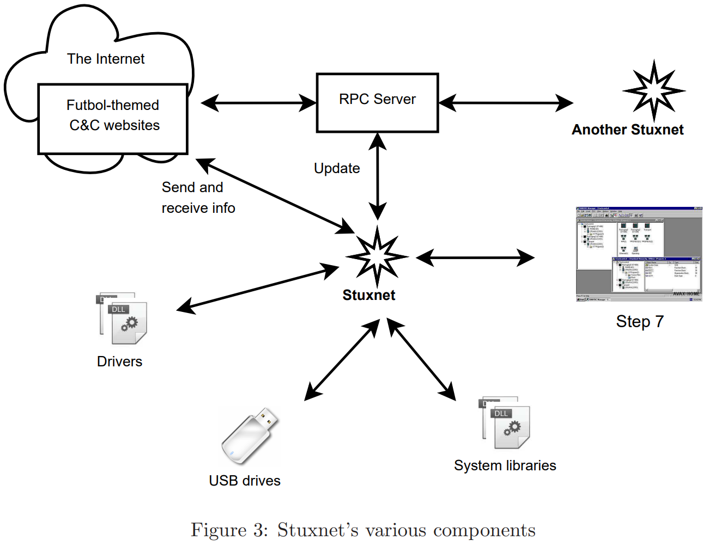
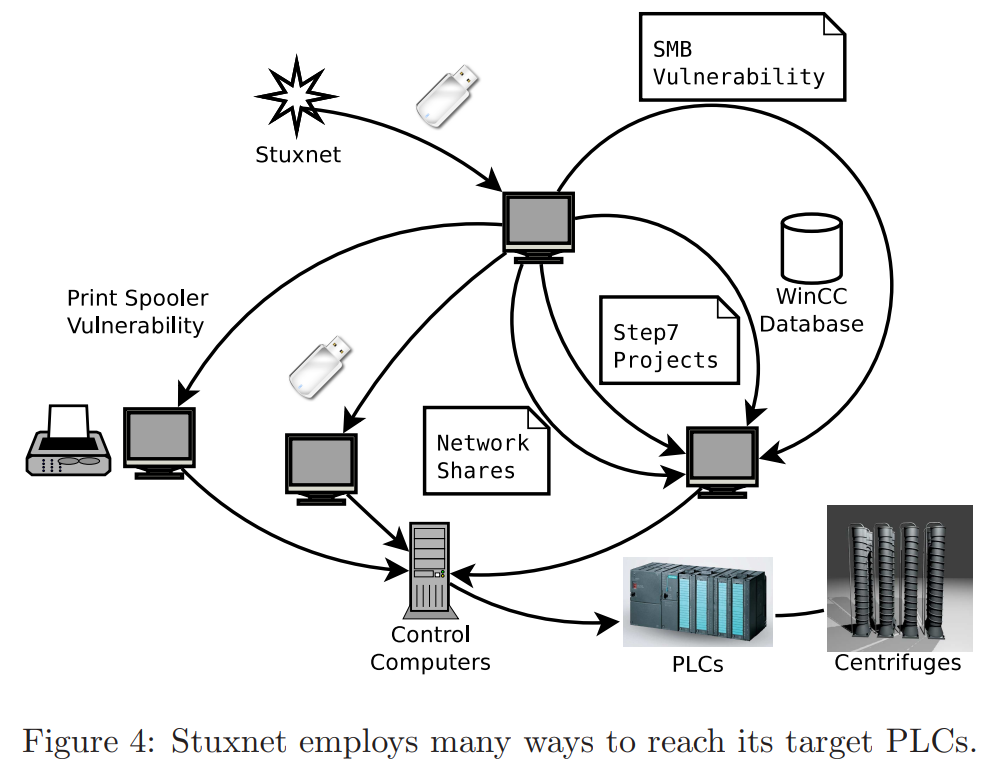
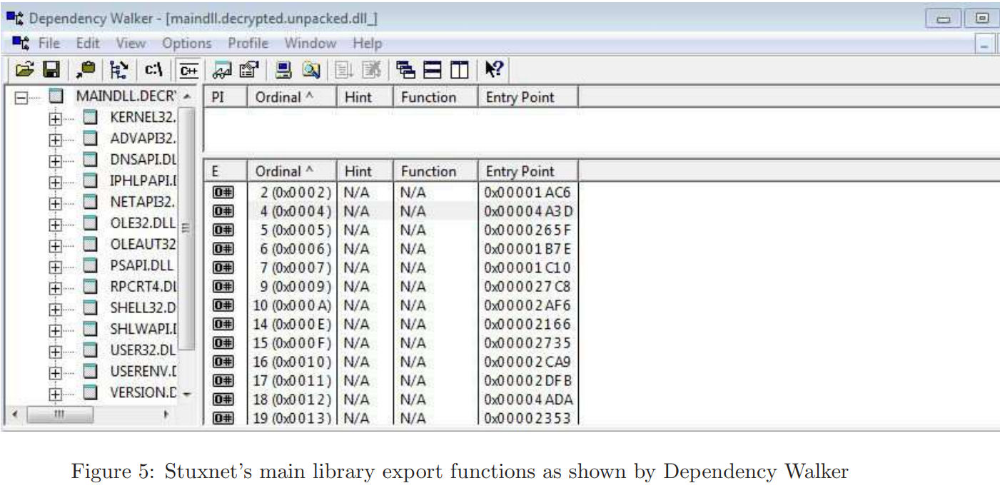
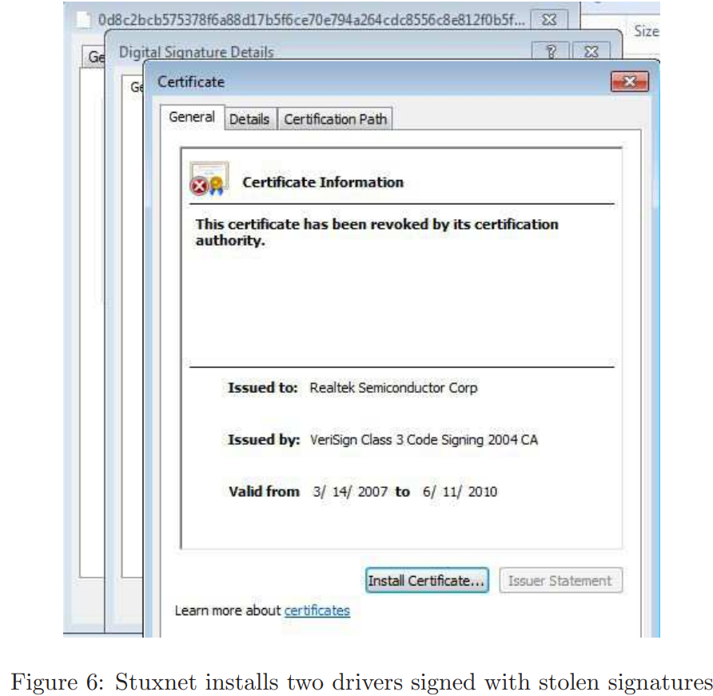
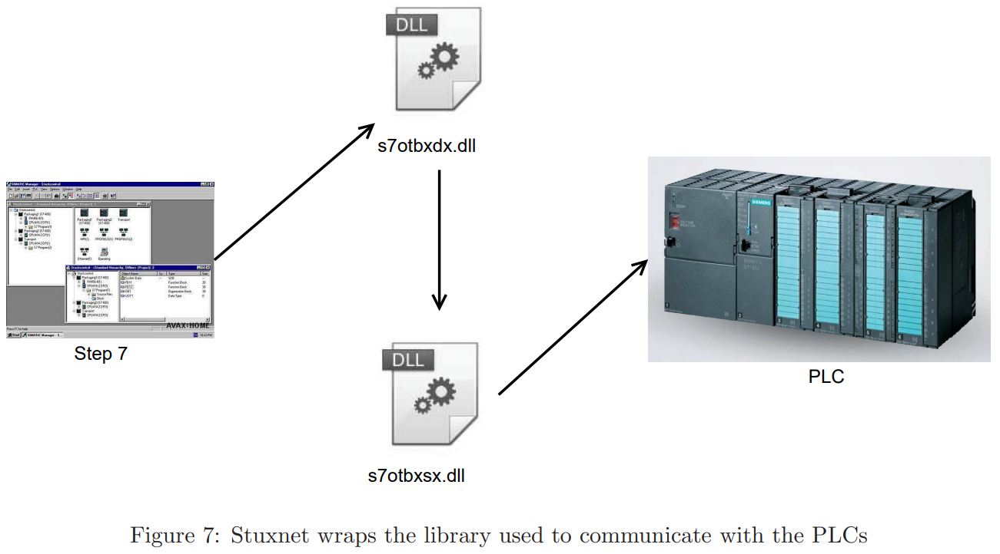

# StuxNet
#### William Douglas Costa Silva - RA 89239

> 

> "Um protótipo funcional e temível de uma cyber-arma que  
> dará início a uma nova corrida armamentista no mundo."

## Introdução
Em novembro de 2010 o governo iraniano declarou que algumas centrífugas de enriquecimento de urânio do programa nuclear nacional haviam sido danificadas, e um vírus havia infectado os computadores pessoais da usina. Esse ataque, em conjunto com outros ataques do mesmo gênero, pode ser considerado o inicio de uma guerra cibernética com potencial para tornar-se uma grande preocupação para os governos de todo o mundo.

Foi descoberto em junho de 2010, e é o primeiro worm descoberto que espiona e reprograma controladores de processos industriais. O StuxNet é capaz de reprogramar CLP's (Controladores Lógicos Programáveis) e esconder as alterações. O virus pode estar camuflado em mais de 100 mil computadores, porém para usuários comuns o worm é inofensivo, só funciona efetivamente em computadores que executem um sistema muito específico de centrífugas de enriquecimento de urânio iranianas, visto que cada usina possui particularidades muito bem definidas.

## StuxNet - Uma Visão Geral
Stuxnet é um vírus sofisticado desenvolvido para atacar apenas um sistema específico SCADA (do inglês *"Supervisory Control and Data Acquisition"*), que é um sistema de controle de processos industriais.

Ele faz uso de quatro vulnerabilidades *zero-day*, que é uma brecha de segurança no sistema ainda desconhecida pelos programadores.

Também faz uso de *rootkits*, que são técnicas avançadas para se auto camuflar dos usuários e de programas anti malwares do Windows. Faz uso de duas certificações digitais roubadas que assinam seus drivers. Além disso, seus desenvolvedores precisaram de um grande conhecimento sobre os sistemas alvo.

É muito aceito que este worm tenha sido desenvolvido para atacar especificamente o programa nuclear iraniano, visto que os ataques condizem perfeitamente com a planta de enriquecimento de urânio de Natanz.
Uma indicação de que o Stuxnet visava o programa nuclear do Irã é que ele só tem como alvo instalações que com um certo layout físico muito específico. O layout das centrífugas em uma instalação como Natanz é chamado de cascata, isso descreve como as centrífugas são conectadas. Neste caso as centrífugas dentro de um estágio são conectadas em paralelo.
Um fato interessante é que em 2008 o presidente do Irã Ahmadinejad visitou a planta de Natanz, e fotos dessa visita foram publicadas em um site, e em uma destas fotos era possível ver a tela de um sistema supervisório que mostrava a estrutura em cascata da então chamada *IR-1*, com base nessa informação era possível identificar o número de centrífugas em cada estágio, o que combina exatamente com a estrutura do código do StuxNet

O programa nuclear iraniano foi lançado por volta de 1950, criando armas fora do programa *Atoms for Peace* dos Estados Unidos. Houve um atraso graças a revolução de 1979 e depois por causa da guerra contra o Iraque. Mesmo assim os líderes iranianos estavam interessados em continuar com o programa nuclear, e começaram a obter ajuda de outros países para avançar.

Em 2002, um grupo de oposição iraniano revelou publicamente duas instalações nucleares não declaradas no Irã, admitindo ter construído instalações para enriquecimento de combustível e produção de água pesada ostensivamente para uso em reatores de pesquisa. O governo suspendeu seus planos em 2003, mas retomou em 2006 argumentando que tinha o direito de estabelecer seu próprio programa de enriquecimento de urânio.

O Irã mantém seu programa completamente em paz, porém a Agência Internacional de Energia Nuclear (IAEA) insiste que o Irã não cumpre com os requisitos de segurança, o que foi motivo de diversas sanções do Conselho de Segurança contra o Irã pelo Conselho de Segurança, que acreditava que o Irã estava trabalhando na produção de armas nucleares.
Assumindo que o StuxNet teve a intençao de danificar esse suposto programa de armas nucleares, a intervenção foi bem sucedida: estima-se que tenha destruído aproximadamente 1000 centrífugas em Natanz, o que representa mais de 11% do número instalado durante todo o período. Além disso, o Irã não tem um número ilimitado de centrífugas, e os que eles têm tendem a falhar com relativa frequência, de modo que tal diminuição é significativa, embora não imediatamente fatal para o programa. Além disso, o Stuxnet diminuiu a produção de urânio enriquecido e provavelmente semeou o caos dentro do programa nuclear iraniano.

Israel e USA são os principais suspeitos de serem os criadores do StuxNet. Também não são amigos do governo iraniano, especialmente Israel, que teme uma guerra nuclear do Irã. Israel afirmou que artifícios cybernéticos são uma parte importante da sua estratégia de defesa, e possui uma unidade militar dedicada a isto. Antes do StuxNet ser descoberto, John Bumgarner, um oficial reformado da inteligência e membro da *United States Cyber-Consequences Unit (US-CCU)* publicou um artigo que descreve um ataque a centrífugas parecido com os modos de operação do StuxNet, e afirma que ataques contra nações que enriquecem urânio 

Antes da descoberta do Stuxnet, segundo a Wikipedia, “John Bumgarner, um ex-intelectual
oficial de segurança e membro da Unidade de Consequências Cibernéticas dos Estados Unidos (US-CCU) ”publicou
um artigo descrevendo um ataque do tipo Stuxnet em centrífugas e alegou que tais ataques contra
as nações que enriquecem urânio em violação de tratados internacionais são legítimas. Isso, combinado com
algumas negações de envolvimento de algumas autoridades americanas levantam suspeitas de que os EUA participaram
Criação do Stuxnet, apesar das negações oficiais

## Operação do Stuxnet
Uma coisa que diferencia o Stuxnet de mais softwares maliciosos comuns é que seus criadores incorporaram muitos recursos nele. Eles vão desde a exploração de vários zero day, modificando bibliotecas de sistemas, atacando instalações Step7 (controle SCADA da Siemens
software) e executando um servidor RPC, para instalar drivers assinados nos sistemas operacionais Windows.
A Figura 3 mostra uma visão geral de vários componentes presentes no malware. Esta seção
descreve esses componentes e seus diversos propósitos.
O Stuxnet se espalha através de vários vetores, sem dúvida selecionado para finalmente infectar os PLCs
tem como alvo. É capaz de atualizar automaticamente, para que possa atualizar versões antigas de si mesma para novas
versões disponíveis em uma rede local. Ele se comunica com os servidores de comando e controle para
forneça informações sobre sua propagação a seus criadores e também forneça outra maneira de atualizar.
Esconde sua presença e a fonte de seus efeitos destrutivos do pessoal da fábrica, que pode ser
totalmente inconsciente de que é a causa de problemas inexplicáveis.
## Como o Stuxnet se espalha
O Stuxnet se espalha rapidamente, mas também contém salvaguardas para limitar sua propagação. Infecta apenas três
computadores de uma determinada unidade flash infectada e é codificado para parar de se espalhar após 24 de junho,
2012.
Como ilustrado na Figura 4, o Stuxnet emprega vários métodos para se espalhar:
Via unidades flash USB O destino final do Stuxnet são os computadores que controlam o
centrífugas. Estes são chamados PLCs (Programmable Logic Controllers) e são para fins especiais
computadores, usados ​​para controlar dispositivos ou sistemas eletrônicos, como sistemas industriais.
Os CLPs estão conectados a computadores que os controlam e monitoram e, normalmente, nenhum deles
Conectado a internet. Portanto, o Stuxnet precisa de algum outro vetor para alcançar esses computadores,
e, portanto, é capaz de se propagar através de unidades flash USB.
No caso de Natanz, as unidades flash infectadas podem ter sido introduzidas nos computadores de controle por meio de contratados externos trabalhando na fábrica.
Versões diferentes do Stuxnet usam maneiras diferentes de fazer isso: versões recentes usam um Windows LNK
vulnerabilidade e versões mais antigas usam uma vulnerabilidade de arquivo autorun.inf.

* Vulnerabilidade do LNK (CVE-2010-2568)

    O Stuxnet registra o código em um computador Windows infectado que, após a inserção de uma unidade USB, copia o Stuxnet para a unidade. Curiosamente, uma cópia existente do Stuxnet no disco externo
    A unidade será removida se ela já tiver infectado três computadores.
    Além da DLL do Stuxnet e de um carregador, o malware cria quatro arquivos .lnk na unidade removível. Eles são usados para executar o carregador quando um usuário visualiza a unidade; quatro
    são necessários para atingir diferentes versões do Windows.

* arquivo autorun.inf

    Um arquivo autorun.inf é um arquivo que faz com que o Windows execute automaticamente um arquivo removível
mídia quando essa mídia é inserida no computador. As versões mais antigas do Stuxnet colocam um
arquivo autorun.inf em unidades flash inseridas em um computador infectado.
No entanto, em vez de usar um arquivo separado, ele insere o código diretamente na execução automática
, juntamente com comandos válidos para infectar o computador usando esse código. O Windows ignora o
Parte de dados do Stuxnet, pois ignora comandos inválidos em um arquivo autorun.inf.

* Via WinCC,

     o Stuxnet procura por computadores executando o Siemens WinCC, uma interface para seus
Sistemas SCADA. Ele se conecta usando uma senha codificada no WinCC e ataca seu banco de dados
usando comandos SQL para fazer upload e iniciar uma cópia de si mesmo no computador WinCC.

* Através de compartilhamentos de rede,
    
     o Stuxnet pode usar pastas compartilhadas do Windows para se propagar por um local
rede. Ele coloca um arquivo conta-gotas em qualquer compartilhamento em computadores remotos e agenda uma tarefa para
execute. A ESET [11] diz que a tarefa está programada para ser executada no dia seguinte, enquanto a Symantec [7] afirma
está agendado para dois minutos após o compartilhamento do arquivo.
Através da vulnerabilidade de 0 dias do spooler de impressão MS10-061, o Stuxnet se copia, coloca o
copiar em computadores remotos por meio dessa vulnerabilidade e, em seguida, executa a cópia, infectando
máquinas remotas. Em resumo, o Stuxnet “imprime” a si mesmo em dois arquivos no diretório% system% em cada
máquina de destino, usando a escalação de privilégios de 0 dias. Em seguida, ele executa o arquivo conta-gotas para infectar o
computador.
Através da vulnerabilidade SM08-067 do MS08 Se um computador remoto tiver essa vulnerabilidade, o Stuxnet
pode enviar um caminho mal formado pelo SMB (um protocolo para compartilhar arquivos e outros recursos entre
computadores); isso permite executar código arbitrário na máquina remota, propagando assim
em si mesmo.

* Via projetos Step7

     O Stuxnet infectará os projetos de controle industrial SIMATIC Step7 da Siemens
que são abertos em um computador infectado. Faz isso modificando DLLs (Windows Dynamic Link
Biblioteca; uma biblioteca de objetos compartilhados: código, dados e recursos) e um arquivo .exe no WinCC
Gerente Simatic, para que eles executem o código Stuxnet também. O código adicional irá inserir o Stuxnet
nos diretórios do projeto Step7.
2.2 Atualização automática
O Stuxnet pode se atualizar a partir de projetos Step7 infectados. Se um projeto infectado for aberto e seu
Se a versão do Stuxnet for mais recente que a do computador, a versão do computador será
Atualizada.
Além disso, o Stuxnet usa uma rede ponto a ponto integrada para atualizar instâncias antigas de si mesma para
a versão mais recente presente em uma rede local. Cada cópia inicia um RPC (Remote Procedure Call)
servidor e ouve conexões. Outras instâncias, conectando-se através de seus clientes RPC, podem
atualizar-se se sua versão for mais antiga ou atualizar o servidor se for mais antiga.

## Servidores de comando e controle
Depois que o Stuxnet se estabelece em um computador, ele tenta entrar em contato com um dos dois servidores via HTTP:
* www.mypremierfutbol.com
* www.todaysfutbol.com

Ele envia seu endereço IP, alguns dados desconhecidos e uma carga útil que consiste, em parte, em informações
no sistema operacional host, o nome do computador host e o nome de domínio e um sinalizador indicando se o Siemens Step7
ou o WinCC, que o Stuxnet visa, está instalado.
O servidor pode responder enviando um executável do Windows, que pode ser especificado para ser carregado
no processo atual ou em outro via RPC. Isso permite que os autores do Stuxnet o atualizem
remotamente ou para executar um malware totalmente novo nos computadores infectados.
Curiosamente, os dados enviados para e do servidor são criptografados, cada um com uma
Chave de 31 bytes (aparentemente aleatórios) que é XORed com os dados. No entanto, ambas as chaves são
estáticas e, portanto, não oferece muita proteção contra alguém que interceptou várias
comunicações.

Os servidores de comando e controle tornaram-se impotentes ao redirecionar seus DNS
entradas (inicialmente para lugar nenhum e posteriormente para servidores falsos, configuradas pela Symantec, para coletar informações
no worm.)
De acordo com a Symantec, o Stuxnet pode se atualizar para se comunicar com o novo comando
e servidores de controle, mas isso não foi observado em campo.
## Infecção
O módulo principal do malware consiste em componentes no modo usuário e no modo kernel. As funções do modo do usuário são projetadas principalmente para fazer várias coisas:

 1) injetar no processo escolhido - adiciona
seu próprio código em um processo em execução, o que resulta na execução desse código no destino
espaço de endereço do processo;

2) verifique a plataforma apropriada;

 3) escalar privilégios;
 
  4) instalar
dois drivers no modo kernel, um para executar o Stuxnet após a reinicialização e o outro como rootkit para ocultar
seus arquivos.
## Modo de usuário
O DLL do módulo principal exporta 21 funções (Figura 5). O Stuxnet inicia chamando export 15.
Nesta função, ele primeiro verifica se está sendo executado em uma versão apropriada do Windows. Supondo que seja e
a máquina ainda não está infectada, ela usa uma das explorações de dia zero, dependendo da versão
do Windows, para elevar seus privilégios.
A exportação 16 é chamada para continuar a instalação: ela injeta código no processo services.exe
infectar unidades removíveis e infectar os projetos Step7 que encontrar. Em seguida, verifica um valor do registro
e interrompe a infecção, se corresponder. Ele também verifica se a data atual é posterior a
24 de junho de 2012 e verifica se está executando a versão mais recente. Se todas essas verificações passarem, ele cairá
dois arquivos de driver para instalar os arquivos de driver, Mrxnet.sys e Mrxcls.sys.

Não está claro se há algum significado especial para a data limite de 24 de junho; pode ser
arbitrário, usado para impedir a propagação do Stuxnet depois de (presumivelmente) já ter causado dano "suficiente".

## Modo Kernel
O Stuxnet instala dois drivers no modo kernel. Mrxcls.sys é um driver assinado por um certificado Realtek como
mostrado na Figura 6. Quando o Stuxnet deseja instalá-lo no sistema, marca-o como uma inicialização de inicialização
então ele começa nos estágios iniciais da inicialização do Windows. Este driver primeiro lê uma chave do registro que possui
foi escrito na etapa de instalação e contém as informações para injetar imagens Stuxnet no
certos processos.

O outro driver, Mrxnet.sys, é na verdade o rootkit e também é assinado digitalmente por um Realtek
certificado. Ele cria um objeto de dispositivo e o anexa aos objetos de dispositivo do sistema para que ele possa
monitorar todas as solicitações enviadas para esses objetos. O objetivo deste trabalho é ocultar arquivos que atendem a determinadas
critérios dos usuários.
## Fase de ataque
O Stuxnet não é prejudicial para usuários comuns, pois seu objetivo é modificar os PLCs Simatic fabricados
por Siemens. Os programas Step7, que controlam e monitoram esses CLPs, usam uma biblioteca chamada
s7otbxdx.dll para se comunicar com o PLC real para ler ou modificar seu conteúdo (códigos). 

Stuxnet
obtém controle sobre todas as solicitações enviadas ao PLC envolvendo esta biblioteca.
Além disso, o Stuxnet grava seu próprio código malicioso para atingir determinados PLCs específicos. Esconde seu
código malicioso dos usuários retornando blocos de códigos originais em vez dos modificados em um
pedido de leitura, conforme ilustrado na Figura 7.
O código que o Stuxnet infecta PLCs contém três seqüências de ataque, denominadas A, B e C em
Relatório da Symantec. As seqüências A e B são semelhantes, com apenas pequenas diferenças e têm as mesmas
efeitos. A sequência C é mais avançada, mas incompleta e nunca é executada.
As sequências A e B executam seus ataques executando os rotores da centrífuga em frequências muito baixas e muito altas (tão baixas quanto altas como 2 e 1410 Hz, respectivamente). Curiosamente, os períodos em
que eles comandam as centrífugas a girar nessas velocidades inadequadas são bastante curtas (50 e
15 minutos, respectivamente) e são separados por cerca de 27 dias entre os ataques, possivelmente indicando que os projetistas queriam que o Stuxnet operasse furtivamente por longos períodos de tempo. 

Embora o tempo decorrido durante o qual as centrífugas sejam mais lentas ou mais rápidas seja provavelmente muito curto para atingirem os valores mínimo e máximo, eles ainda resultam em
desacelerações e acelerações significativas. As velocidades lentas são suficientes para resultar em urânio ineficientemente processado, e as altas velocidades são provavelmente suficientes para resultar nas centrífugas sendo realmente
destruídos, pois estão no limite de velocidade máxima das centrífugas.
## Ocultação de atividades de ataque
O Stuxnet se esconde do pessoal da instalação instalando rootkits em computadores Windows infectados e
em PLCs infectados, para ocultar seus arquivos. Ao instalar um driver em computadores Windows, ele oculta
manipulando solicitações enviadas aos dispositivos.
Ao interceptar chamadas para s7otbxdx.dll, o Stuxnet oculta o código malicioso que grava nos CLPs para sabotagem de centrífugas e também impede que esses códigos maliciosos sejam substituídos.

Antes de o malware executar uma rotina de ataque, ele registra as frequências normais de operação das centrífugas e alimenta esses dados gravados no programa de monitoramento WinCC durante o ataque. O resultado é
que o sistema mostra operação normal em vez de alertar o pessoal sobre as frequências anômalas que
as centrífugas estão realmente funcionando.

O Stuxnet também modifica algumas rotinas nos CLPs, impedindo um desligamento seguro, mesmo que o
O operador descobre que o sistema não está funcionando normalmente.
## Conclusão
O Stuxnet é um malware de tal sofisticação que provavelmente é o trabalho de um ou mais países,
sendo Israel e / ou os EUA o (s) autor (es) presumido (s). Ele se espalhou pelo mundo, mas a maioria dos
suas infecções ocorreram no Irã e parece que o único local em que ativou sua carga útil foi Natanz.
Agora, quase dois anos após a descoberta de Stuxnet, o Irã parece ter expurgado-a de seus
Equipamento Natanz, de acordo com um artigo da Reuters. O artigo foi publicado em fevereiro de 2012,
mas afirma que não se sabe exatamente quando os iranianos conseguiram limpar seus sistemas do
infecção, então eles podem estar claros há algum tempo.
É provável que o Stuxnet tivesse um impacto maior se não fosse percebido pela segurança de 
pesquisadores, que posteriormente publicaram relatórios detalhados sobre o assunto. Provavelmente destruiu cerca de 1.000 centrífugas e atrasou o programa de armas nucleares do Irã,
mas provavelmente não teve tanto impacto quanto seus criadores esperavam.
Agora que os iranianos estão em alerta para o Stuxnet em ameaças específicas e semelhantes em geral,
provavelmente será mais difícil realizar outro ataque contra eles. Assim, a melhor chance de descarrilar ou
Atraso menos significativo O programa de armas nucleares do Irã provavelmente já passou, o que nos deixa com
a perspectiva preocupante de Israel, com ou sem ajuda dos EUA, atacando militarmente o Irã.
O Stuxnet também aumentou a conscientização sobre a vulnerabilidade dos sistemas de controle industrial, que
não foi alvo de muitos ataques. Isso deve resultar em eles se tornarem mais endurecidos
contra ataques com o passar do tempo, mas isso é equilibrado contra o aumento do risco de tais ataques.
O Stuxnet aumentou a probabilidade de autores de malware, sejam estados-nação ou menores
entidades, perpetrarão ataques semelhantes no futuro. Provou que tais ataques são possíveis,
conhecimento sobre eles e talvez interesse neles entre entidades maliciosas, além de fornecer uma base de código sofisticada para os autores de malware estudarem e modificarem.
Presumivelmente, supondo que os EUA e / ou Israel fossem os criadores do Stuxnet, eles fizeram uma análise custo-benefício, levando em consideração seu potencial de dissuadir as ambições nucleares do Irã contra o aumento
risco de ataque semelhante contra si e aos outros. Eles devem ter concluído que o risco valia a pena. Espero que eles não se provem errados nos próximos anos.

## Referências

The Stuxnet Worm
Paul Mueller and Babak Yadegari

David Albright, Paul Brannan, and Christina Walrond. Did stuxnet take out 1,000 centrifuges
at the natanz enrichment plant? Technical report, World Wide Web, http://isis-online.
org/uploads/isis-reports/documents/stuxnet_FEP_22Dec%2010.pdf